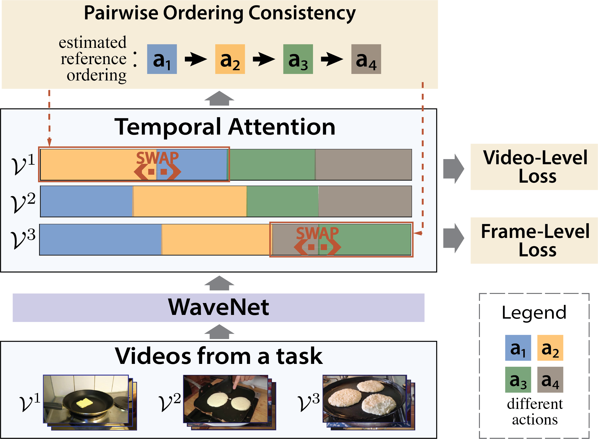

# CVPR22-POC
This is the official code for our CVPR 2022 paper "**Set-Supervised Action Learning in Procedural Task Videos via Pairwise Order Consistency**".




# Dataset

- Please create a `dataset` folder and download datasets from this shared [folder](https://drive.google.com/drive/folders/1iutcvduxaPINL-liOR_QsxbtgwE-zMXV?usp=sharing).

- The features for Breakfast are stored in `Breakfast features` folder. Please download and rename it as `dataset/Breakfast/features`.

- The `action_occurrence.txt` in each dataset folder is created by `src/utils/generate_action_occurrence_txt.py`.


# Training
To train model on a dataset, e.g., Breakfast, please use command:
```bash
python -m src.train \
    --cfg src/configs/breakfast.yaml \
    --runs 1 2 3 \
    --set dataset.split 1 gpu 7
```

It will train POC model for three runs. Network checkpoints and evaluation results will be saved to `log` folder.

More training options are included in `src/configs/default.py`.

# Citation
Please cite us with
```
@InProceedings{Lu_2022_CVPR,
    author    = {Lu, Zijia and Elhamifar, Ehsan},
    title     = {Set-Supervised Action Learning in Procedural Task Videos via Pairwise Order Consistency},
    booktitle = {Proceedings of the IEEE/CVF Conference on Computer Vision and Pattern Recognition (CVPR)},
    month     = {June},
    year      = {2022},
    pages     = {19903-19913}
}
```

